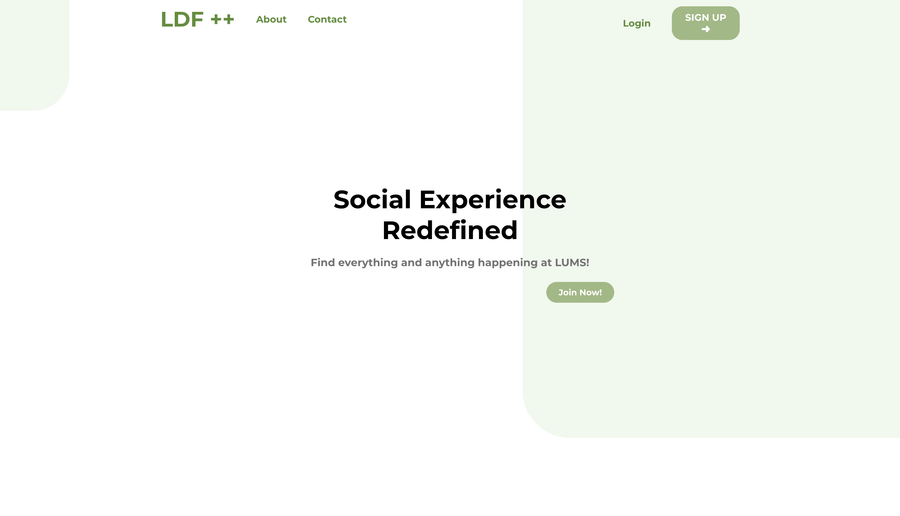

# Community Discussion Social Forum 

## Description

The Community Discussion Social Forum is an application designed exclusively for LUMS students from diverse backgrounds to connect and share information and discuss about ongoing campus activities. The design and use-cases are extracted from the exisiting Facebook Group that was previously being utilized for this purpose. Built using the MERN stack, the platform aims to increase collaboration and of various cultural backgrounds. The platform is equipped with advanced features to enhance accessibility and user engagement.

## Features

1. **Connect**: The platform supports connecting with other peers.
2. **Discussion Portal**: Integrated Portal for discussing topics regarding course enrollment, instructor reviews, events etc..
3. **Marketplace**: Integrated Marketplace to buy/sell stuff to the community.
4. **User Engagement**: Users can engage with posts through the comments section.
5. **Post Management**: Users can create, edit, delete, and manage their posts.
6. **Authentication**: Utilizes JWT authentication for secure login and registration.
7. **Post Viewing**: Users need to log in to view the complete details of a post.
8. **Search Functionality**: Users can search for specific posts.

## Tech Stack

- **Frontend**: React.js
- **Backend**: Node.js, Express.js
- **Database**: MongoDB
- **Authentication**: JWT (JSON Web Tokens)
- **Middleware**: Various custom and third-party middlewares for enhanced functionality

